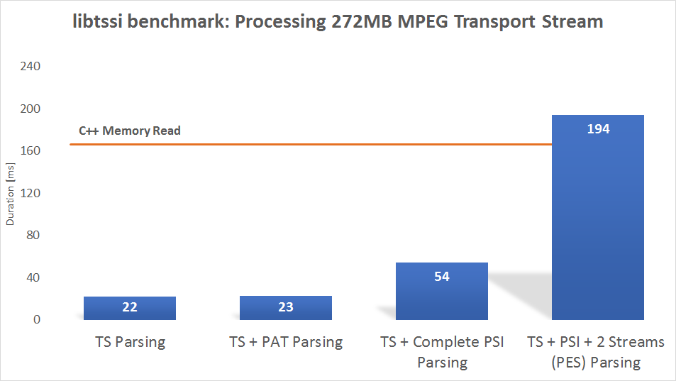

# tssi2 (Transport Stream Service Information v2)

tssi2 is a header-only library for parsing MPEG-2 and DVB Transport Streams in the domain of multimedia processing applications. 

The entire implementation is provided inline in the headers under the include directory. A reference documentation is stored under docs. A modern C++ compiler (C++ 14 / C++ 17) is necessary.

While the main header [include/tsparser.hpp](./include/tsparser.hpp) provides access to the whole library, it is also possible to break out required parts. This comes in handy if you already have a PSI or PES assembler and need some additional tables or descriptors - in this case just include [include/specifications.hpp](./include/specifications.hpp).

Dependencies:

  - [C++ Guideline Support Library](https://github.com/Microsoft/GSL) (header-only, included; mostly needed for `gsl::span<const T>`, a type just waiting for replacement by `std::array_view<T>` or `std::basic_string_view<T>`)

## License

The GNU General Public License v3 applies to this project. 

If you need another (e.g. commercial) license, [contact me](https://goforcode.com).

## Features
<dl>
<dt>📌 Fast</dt>
<dd>See <a href="#benchmark">Benchmark</a></dd>
<dt>📌 Modern and leak-free <a href="https://www.youtube.com/watch?v=JfmTagWcqoE">by default</a></dt>
<dd>C++ 14 / C++ 17 / GSL</dd>
<dt>📌 Under active development</dt>
<dd>If there has not been an push for a while the next one will happen nevertheless.</dd>
<dt>📌 Lightweight</dt>
<dd>The library is a few kb in size and header-only.</dd>
<dt>📌 Cross-platform</dt>
<dd>Windows, Linux, Mac,... should be supported</dd>
<dt>📌 No-throw</dt>
<dd>Transport Streams are prone to data corruptions. tssi2 is designed to handle data errors and not to throw. This is not a no-throw guarantee! Some functions might throw (see the docs).</dd>
<dt>📌 Multi-threading support</dt>
<dd>Reentrant with shared mutual exclusion</dd>
<dt>📌 (To some extent) class-less</dt>
<dd>Processing of MPEG and DVB objects by stateless functions. No class overhead.</dd>
<dt>📌 Modular</dt>
<dd>Custom data processors can replaced provided processors on any level. Custom allocators are supported as well.</dd>
</dl>

[libtssi1](https://github.com/goforcode-com/libtssi) offers some nice features like ISO 13818-6 handling and will remain available on GitHub.

## Benchmark

libtssi2 is compared against the simple memory read operation `read`.

```c++
void read(span<const char> data) {
    for (auto v : data) {}
}
```

Only the time spent in libtssi2 or `read`is measured. Disc to memory transfers are omitted. Data is processed in 1MB chunks.



All tests were conducted on a HP Spectre x360 with Intel Core i7-7500U. The source code is available under [examples/benchmark](./examples/benchmark/).

## Quick start
We want to detect the transmission time of a Transport Stream. Let us suppose you already have included the stream and vector files from C++ and introduced the namespace `std` (a source file is available, see examples). 

First of all, we load a Transport Stream into a buffer variable.
```c++
auto f = ifstream{ "examples/data/ard.ts", ifstream::binary };
auto b = vector<char>( 4000000 );
f.read(b.data(), b.size());
```
Keep in mind to check for errors in real programs. We skip this part to illustrate the API itself.

We now create a `TSParser` providing 188-byte TS packets and a `PSIHeap` that will process the packets and stores program-specific information.
```c++
auto ts = tssi::TSParser<>();
auto psi = tssi::PSIHeap<>();
```
The time and date information is stored on packets with PID `0x14`. We tell the parser what packets we are interested in and where to send them.
```c++
ts.pid_parser({ 0x14 }, psi);
```
This **could** also be a lambda
```c++
ts.pid_parser({ 0x100, 0x200, 0x300 }, [&] (auto data) { });
```
Or `PESAssembler` if you are interested in packetized elementary streams.

With the buffer and parser set up, we can process the data.
```c++
ts(b);
```

The PSI table_ids we are looking for are `0x70` and `0x73`.
```c++
for (auto& v : psi.psi_heap())
    // v.first: section_identifier tuple 
    //   (table_id, table_id_ext, section_number)
    // v.second: PSISection
    if ((get<0>(v.first) == 0x70) || (get<0>(v.first) == 0x73)) {
```
Direct access to the section's data is available via `v.second.psi_data()`.
```c++
        auto data = v.second.psi_data();
```
The functions to analyze sections and descriptors are organized in namespaces. Utilize the `using` statement if appropriate.
```c++
        using namespace tssi::etsi300468::time_date_section;
        auto time = UTC_time(data);
        cout << ctime(&time) << endl;
        break;
    }	
```
The program might now result in an output like:
```sh
  Fri Oct 28 23:06:06 2005
```

## Documentation

Download or clone the repository to access the HTML documentation located under [docs](./docs). For a full definition of all values have a look at the mentioned specifications.

## Examples

Advertise by utilize:

 - [Data](./examples/data/): 272MB Transport Stream sample (approx. 1min DVB satellite capture), test file for the following examples.
 - [Minimal](./examples/minimal/): The quick start guide's source code.
 - [Benchmark](./examples/benchmark/): Basic chronometry.
 - [PSI Data](./examples/psidata/): Parsing of Program-specific information to HTML.
 - [Audio/Video Parser](./examples/avparser/): Extraction of elementary stream (audio and video in this case) to disc.
 - [Multi-threading](./examples/multithreading/): A demo on reading from `PSIHeap` while `TSParser` tries to fill it with new information.
 - [Video player](./examples/videoplayer/): A video player using ffmpeg and SDL2.

## Building the docs

Should you want to build the docs for yourself, make [robodoc](http://rfsber.home.xs4all.nl/Robo/) available and use `doc.sh`or `doc.bat`. Modify the style either in the respective file or in `robodoc.rc`.


